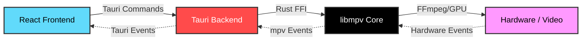

# <p align="center">  <br> Sonix Media Player </p>

<p align="center">
  
  
  
</p>

<p align="center">
  <strong>The high-performance, cross-platform media player for the modern era.</strong> <br>
  Built with ❤️ using <strong>Tauri v2</strong>, <strong>Rust</strong>, and <strong>React</strong>.
</p>

---

## 🌟 Overview

**Sonix** is a premium, open-source media player designed for elegance and speed. Inspired by the versatility of VLC and the aesthetics of IINA, Sonix brings a **zero-config**, hardware-accelerated experience to your desktop.

## 🚀 Key Features

- 🏎️ **Hardware Acceleration:** Native GPU decoding for seamless 4K and HDR playback.
- 📦 **Zero-Config:** Support for over 300+ codecs out of the box via `libmpv`.
- 💎 **Premium UI:** Moderately dark, glassmorphic design with adaptive colors.
- 🖼️ **Picture-in-Picture:** Multi-tasking made easy with a native PiP mode.
- ⌨️ **Keyboard First:** Power-user friendly with customizable shortcuts.
- 🧩 **Advanced Subtitles:** Built-in support for embedded and external `.srt` / `.vtt` tracks.

## 🛠️ Technology Stack

| Component | Technology | Why? |
| :--- | :--- | :--- |
| **Backend** |  | Blazing fast performance & memory safety. |
| **Shell** |  | Lightweight cross-platform framework. |
| **Frontend** |  | Dynamic & responsive UI components. |
| **Styling** |  | Modern, CSS-first design system. |
| **Engine** |  | Industry-standard media engine. |

## ⚙️ Architecture

The backend and frontend communicate via an event-driven synchronization layer, ensuring low-latency control and a fluid experience.



## 📦 One-Click Installation

Getting started with Sonix is simple. Choose your platform and run the one-click installer:

### 🐧 Linux
```bash
curl -fsSL https://get.sonix.app/linux | sh
```

### 🪟 Windows
```powershell
iwr https://get.sonix.app/windows -useb | iex
```

### 🍎 macOS
```bash
brew install --cask sonix-player
```

---

## 🏗️ Development Standards

All contributions must follow our [Engineering Standards Charter](./docs/engineering-standards.md). We maintain high performance, reliability, and security across the codebase.

1.  **Strict TypeScript:** No `any` allowed.
2.  **Rust Backend:** Return typed errors, no panics in runtime paths.
3.  **Tauri v2 Permissions:** Least-privilege capabilities.
4.  **Performance:** Control commands must respond within **100 ms**.

## 🤝 Contributing

We welcome all contributors! Whether you're fixing bugs, adding features, or improving documentation, check out our [Task List](./docs/list-of-task.md) for current priorities.

## 📄 License

This project is licensed under the [MIT License](LICENSE).

---

<div align="center">
  
  <p>Built with ❤️ by <a href="http://kaiofficial.xyz/" target="_blank"><b>KAI</b></a></p>
</div>
