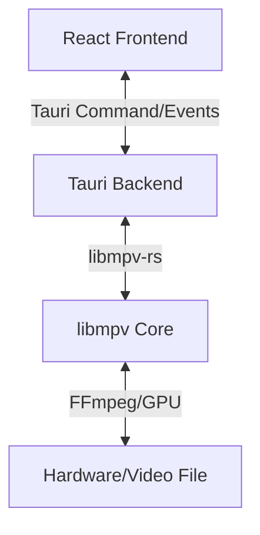

# Media Player Project Plan

## 1. Project Overview
A high-performance, cross-platform desktop media player designed for a premium user experience. Inspired by VLC's versatility and IINA's modern aesthetics.

## 2. Technical Stack
*   **Core Engine:** `libmpv` (C-library) via Rust FFI.
*   **App Shell:** Tauri v2 (Rust).
*   **Frontend:** Vite + React + TypeScript.
*   **Styling:** Tailwind CSS v4.
*   **Animations:** Framer Motion.

## 3. High-Level Architecture

## 4. Key Features
- **Zero-Config Playback:** Support for 300+ codecs via mpv.
- **Hardware Acceleration:** Native GPU decoding for 4K/HDR content.
- **Modern UI:** 
    - Glassmorphic controls.
    - Floating/Hidden playback bar.
    - Adaptive color theme based on video content.
- **Advanced Controls:**
    - Frame-by-frame scrubbing.
    - Subtitle track & Audio track switching.
    - Custom shaders for video upscaling.

## 5. Implementation Phases
### Phase 1: Foundation
- Initialize Tauri v2 project.
- Set up Rust backend with `libmpv` integration.
- Implement basic window and video surface.

### Phase 2: Core Logic
- Play/Pause/Seek functionality.
- Volume & Mute controls.
- File associations (Double-click to open).

### Phase 3: Premium UI
- Tailwind CSS v4 setup.
- Glassmorphic interface design.
- Animated micro-interactions with Framer Motion.

### Phase 4: Beyond VLC
- Playlist management.
- Video filters (Brightness, Contrast, Saturation).
- Picture-in-Picture (PiP) mode.

## 6. Success Metrics
- **Startup Time:** < 2 seconds.
- **Memory Usage:** < 150MB (during 1080p playback).
- **Format Support:** 100% of standard VLC-supported formats.
