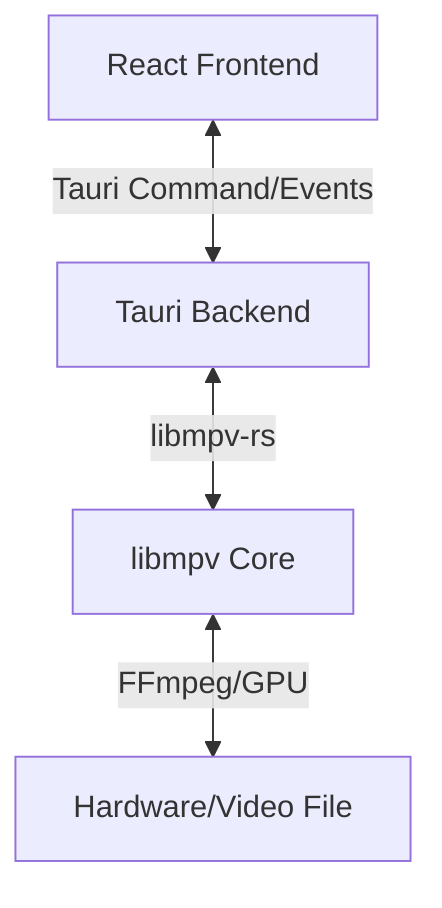

# Media Player Project Plan

## 1. Project Overview
A high-performance, cross-platform desktop media player designed for a premium user experience. Inspired by VLC's versatility and IINA's modern aesthetics.

### Engineering Baseline
All implementation must follow the project standards in [Engineering Standards Charter](engineering-standards.md).

### Product Goal
Deliver a stable, low-latency player for everyday and power users with modern UX, broad format compatibility, and predictable resource usage.

## 2. Technical Stack
*   **Core Engine:** `libmpv` (C-library) via Rust FFI.
*   **App Shell:** Tauri v2 (Rust).
*   **Frontend:** Vite + React + TypeScript.
*   **Styling:** Tailwind CSS v4.
*   **Animations:** Framer Motion.

## 3. High-Level Architecture

### Runtime Modules
- **UI Layer (React):** Rendering, controls, keyboard shortcuts, settings, playlist.
- **State Layer:** Event-driven playback state cache (`time-pos`, `duration`, `pause`, tracks, volume).
- **Command Layer (Tauri commands):** Validated request boundary from UI to backend.
- **Engine Layer (Rust + libmpv):** Playback control, track metadata, hardware decode, event loop.
- **OS Integration:** File-open associations, drag-and-drop, multi-window support.

## 4. Key Features
- **Zero-Config Playback:** Support for 300+ codecs via mpv.
- **Hardware Acceleration:** Native GPU decoding for 4K/HDR content.
- **Modern UI:** 
    - Glassmorphic controls.
    - Floating/Hidden playback bar.
    - Adaptive color theme based on video content.
- **Advanced Controls:**
    - Frame-by-frame scrubbing.
    - Subtitle track & Audio track switching.
    - Custom shaders for video upscaling.

## 5. Non-Functional Requirements
- **Reliability:** No hard crash in common playback flows (open, seek, pause/resume, subtitle switch, close).
- **Responsiveness:** Playback controls should respond within 100 ms for local files on reference hardware.
- **Security:** Tauri v2 capability-based permissions must be least-privilege by default.
- **Observability:** Structured logs for backend events, errors, and command failures.
- **Accessibility:** Keyboard-first control path and visible focus states in the UI.
- **Portability:** Linux, Windows, and macOS support with platform-specific decode fallbacks.

## 6. Validation Matrix
- **OS:** Ubuntu LTS, Windows 11, macOS latest stable.
- **Media:** H.264, H.265/HEVC, VP9, AV1 (where supported), AAC, Opus, FLAC.
- **Containers:** MP4, MKV, MOV, WebM.
- **Subtitles:** Embedded + external `.srt` and `.vtt`.
- **Scenarios:** Open/close loops, rapid seeking, track switching, window resize, PiP toggle.

## 7. Implementation Phases
### Phase 1: Foundation
- Initialize Tauri v2 project.
- Set up Rust backend with `libmpv` integration.
- Implement basic window and video surface.
- Establish linters/formatters and enforce naming/convention rules from the standards charter.

### Phase 2: Core Logic
- Play/Pause/Seek functionality.
- Volume & Mute controls.
- File associations (Double-click to open).

### Phase 3: Premium UI
- Tailwind CSS v4 setup.
- Glassmorphic interface design.
- Animated micro-interactions with Framer Motion.

### Phase 4: Beyond VLC
- Playlist management.
- Video filters (Brightness, Contrast, Saturation).
- Picture-in-Picture (PiP) mode.

## 8. Delivery Gates
- **Gate A (Foundation):** App opens media and renders video reliably on one target OS.
- **Gate B (Core Playback):** Play/pause/seek/volume stable with event synchronization and no state drift.
- **Gate C (Premium UI):** Animated controls are smooth and do not cause playback stutter.
- **Gate D (Advanced):** Subtitles, playlist, and PiP complete with basic regression checks.
- **Gate E (Release):** Cross-platform packaging, signing/notarization strategy, and CI artifacts.
- **Gate F (Standards Compliance):** Naming, code conventions, security permissions, and DoD checks pass per standards charter.

## 9. Success Metrics
- **Startup Time:** p95 under 2.5 seconds for warm start on reference hardware.
- **Memory Usage:** under 220 MB during 1080p H.264 playback after 5 minutes.
- **Control Latency:** p95 under 100 ms for play/pause/seek commands.
- **Stability:** zero critical crashes in validation matrix smoke run.
- **Format Coverage:** pass all formats in the validation matrix (not absolute parity with VLC).

## 10. Risks And Mitigations
- **GPU decode variability by platform:** Provide automatic fallback to software decode and expose status in UI.
- **Thread contention in backend:** Use single-writer command queue for mpv interactions.
- **Event flood to frontend:** Throttle high-frequency events and batch where possible.
- **Containerized GUI complexity:** Keep Docker optional for development; document native setup as default path.
